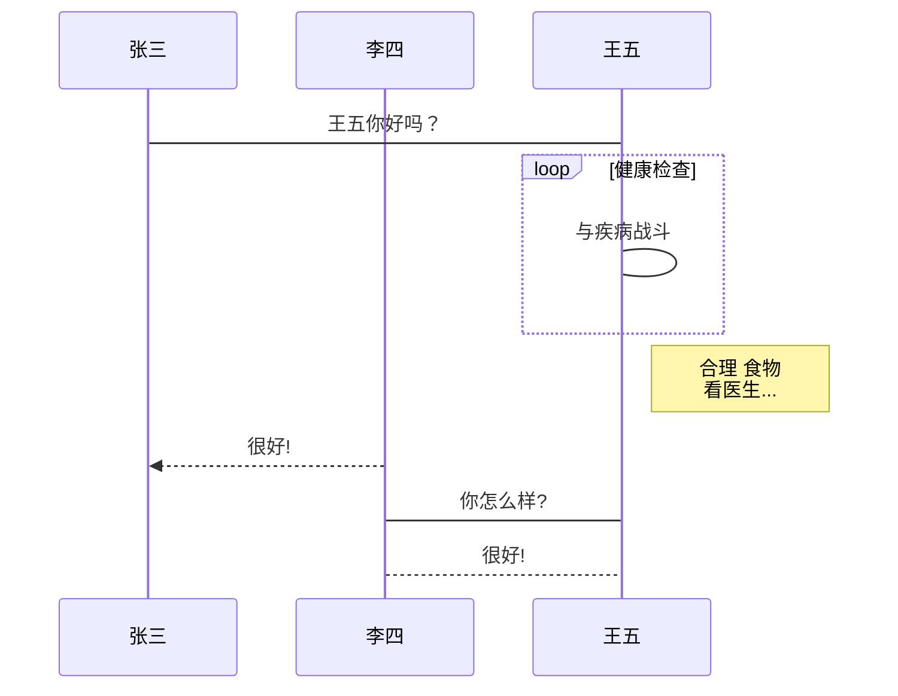
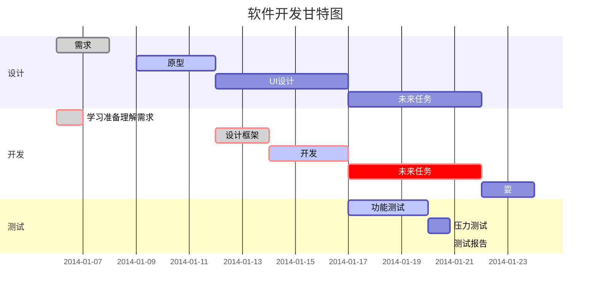
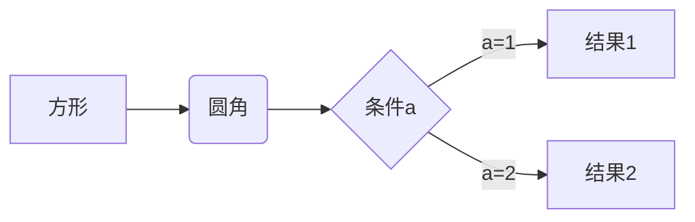
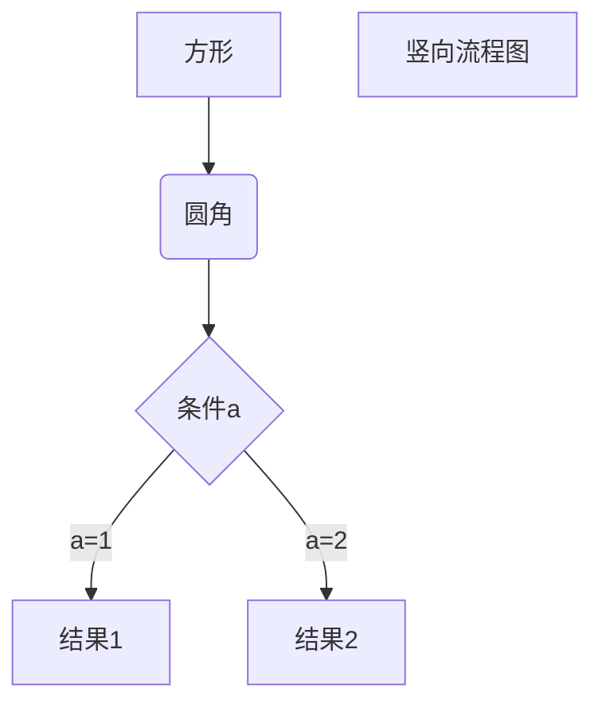
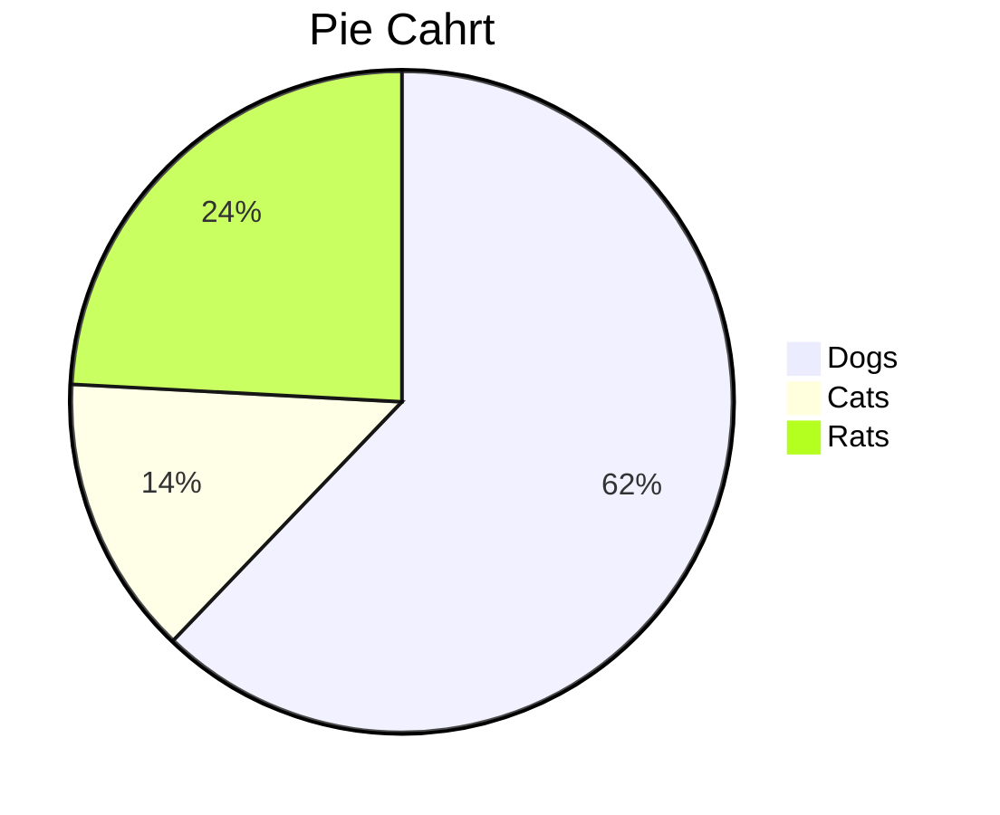

# Typora使用教程

### 标题

> 一级标题	#	或者快捷键 ctrl + 1
>
> 二级标题	##  或者快捷键 ctrl + 2
>
> 六级标题	######	或者快捷键 ctrl + 6

### 引用文字

> \> + 空格 + 引用文字

### 列表

> 无序列表（在列表内容前加上\+, \*, \- 等，符号和列表内容之间要有一个空格）
>
> > * AA	[\* AA]
> > * BB    [\* BB]
> > * CC    [\* CC]
>
> 有序列表（在列表内容前加上数学序号，但序号和列表内容之间要有一个空格）
>
> > 1. AA	[1. AA]
> > 2. BB    [2. BB]
> > 3. CC    [3. CC]

### 任务列表

> -[ ] 不勾选
>
> -[x] 勾选

### 代码块

在Typora中输入 ``` + 回车，并在后面选择一个语言名称即可语法高亮。

>语法高亮代码块：
>
>例如： \```python 回车即可
>
>```python
>def helloWorld():
>print('hello, world')
>```

### 数学公式

有两种方式插入数学公式：行内公式（内联公式）、行间公式（外联公式）

输入$$，然后按 回车 键即可，如下：

> 常用声调：
>
> > |     语法      |      效果       |      语法      |       效果       |   语法   |    效果    |
> > | :-----------: | :-------------: | :------------: | :--------------: | :------: | :--------: |
> > |    \bar{x}    |    $\bar{x}$    | \check{\alpha} | $\check{\alpha}$ | \dot{x}  | $\dot{x}$  |
> > | \tilde{\iota} | $\tilde{\iota}$ |  \hat{\alpha}  |  $\hat{\alpha}$  | \ddot{y} | $\ddot{y}$ |
>
> 函数：
>
> > |                   语法                   |                    效果                    |                  语法                  |                   效果                   |
> > | :--------------------------------------: | :----------------------------------------: | :------------------------------------: | :--------------------------------------: |
> > |                \sin\theta                |                $\sin\theta$                |               \cos\theta​               |              $ \cos\theta$               |
> > |            \arcsin\frac{L}{r}            |            $\arcsin\frac{L}{r}$            |           \arccos\frac{T}{r}​           |           $\arccos\frac{T}{r}$           |
> > |            \operatorname{sh}j            |            $\operatorname{sh}j$            |         \operatorname{argsh}k​          |         $\operatorname{argsh}k$          |
> > |                  \max H                  |                  $\max H$                  |                 \min L​                 |                 $\min L$                 |
> > |                  \log X                  |                  $\log X$                  |                 \ln X​                  |                 $\ln X$                  |
> > |              \log_\alpha X               |              $\log_\alpha X$               |             \lim_{t\to n}T​             |             $\lim_{t\to n}T$             |
> > |                 \left \\                 |           \frac{a}{b} \right \\            |                                        |     $\left \|\frac{a}{b} \right \|$      |
> > |        \left( \frac{a}{b} \right)        |        $\left( \frac{a}{b} \right)$        |      \left\{ \frac{a}{b} \right\}      |      $\left\{ \frac{a}{b} \right\}$      |
> > | \left \langle \frac{a}{b} \right \rangle | $\left \langle \frac{a}{b} \right \rangle$ |       \left[ \frac{a}{b} \right]       |       $\left[ \frac{a}{b} \right]$       |
> > | \left \lfloor \frac{a}{b} \right \rfloor | $\left \lfloor \frac{a}{b} \right \rfloor$ | \left \lceil \frac{c}{d} \right \rceil | $\left \lceil \frac{c}{d} \right \rceil$ |
> > |      \left \{ \frac{a}{b} \right .       |       $\left \{ \frac{a}{b} \right.$       |     \left . \frac{a}{b} \right \}      |     $\left . \frac{a}{b} \right \}$      |
>
> 同余：
>
> > |   语法   |    效果    |    语法     |    效果     |
> > | :------: | :--------: | :---------: | :---------: |
> > | \pmod{m} | $\pmod{m}$ | $a \bmod b$ | $a \bmod b$ |
>
> 微分：
>
> > |    语法     |     效果      |    语法    |     效果     |
> > | :---------: | :-----------: | :--------: | :----------: |
> > |   \nabla    |   $\nabla$    | \partial x | $\partial x$ |
> > | \mathrm{d}x | $\mathrm{d}x$ |   \dot x   |   $\dot x$   |
>
> 集合：
>
> > |    语法     |     效果      |        语法         |     效果      |
> > | :---------: | :-----------: | :-----------------: | :-----------: |
> > |   \forall   |   $\forall$   |       \exists​       |   $\exists$   |
> > |   \empty    |   $\empty$    |      \emptyset​      |  $\emptyset$  |
> > | \varnothing | $\varnothing$ |         \in​         |     $\in$     |
> > |     \ni     |     $\ni$     | \not\in 或者 \notin​ |   $\not\in$   |
> > |   \supset   |   $\supset$   |      \supseteq​      |  $\supseteq$  |
> > |   \subset   |   $\subset$   |      \subseteq​      |  $\subseteq$  |
> > |    \cap     |    $\cap$     |       \bigcap​       |   $\bigcap$   |
> > |    \cup     |    $\cup$     |       \bigcup​       |   $\bigcup$   |
> > |  \sqsubset  |  $\sqsubset$  |     \sqsubseteq​     | $\sqsubseteq$ |
> > |   \sqcap    |   $\sqcap$    |       \sqcup​        |   $\sqcup$    |
>
> 逻辑：
>
> > |     语法      |      效果       |      语法      |       效果       |
> > | :-----------: | :-------------: | :------------: | :--------------: |
> > |       p       |       $p$       |     \land      |     $\land$      |
> > |    \wedge     |    $\wedge$     |   \bigwedge    |   $\bigwedge$    |
> > | \bar{q} \to p | $\bar{q} \to p$ |    \bigvee     |    $\bigvee$     |
> > |     \vee      |     $\vee$      |      \lor      |      $\lor$      |
> > |     \lnot     |     $\lnot$     |     \neg q     |     $\neg q$     |
> > |   \setminus   |   $\setminus$   | \smallsetminus | $\smallsetminus$ |
>
> 根号：
>
> > |   语法   |    效果    |    语法     |     效果      |
> > | :------: | :--------: | :---------: | :-----------: |
> > | \sqrt{3} | $\sqrt{3}$ | \sqrt[n]{3} | $\sqrt[n]{3}$ |
>
> 关系符号：
>
> > |                     语法                     |                   效果                    |
> > | :------------------------------------------: | :---------------------------------------: |
> > |           \Delta ABC\sim\Delta XYZ           |        $\Delta ABC\sim\Delta XYZ$         |
> > |     \sqrt{3} \approx 1.732050808 \ldots      |   $\sqrt{3} \approx 1.732050808 \ldots$   |
> > |                    \simeq                    |                 $\simeq$                  |
> > |                    \cong                     |                  $\cong$                  |
> > |                    \dot=                     |                  $\dot=$                  |
> > |                     \ggg                     |                  $\ggg$                   |
> > |                     \gg                      |                   $\gg$                   |
> > |                     \ge                      |                   $\ge$                   |
> > |                    \geqq                     |                  $\geqq$                  |
> > |                     \leq                     |                  $\leq$                   |
> > |                    \leqq                     |                  $\leqq$                  |
> > |                     \ll                      |                   $\ll$                   |
> > |                     \lll                     |                  $\lll$                   |
> > | (x-y)^2 \equiv (-x+y)^2 \equiv x^2-2xy + y^2 | $(x-y)^2\equiv(-x+y)^2\equiv x^2-2xy+y^2$ |
> > |                x\not\equiv N                 |              $x\not\equiv N$              |
> > |                    x\ne A                    |                 $x\ne A$                  |
> > |                  t\propto v                  |               $t\propto v$                |
> > |                     \pm                      |                   $\pm$                   |
> > |                     \mp                      |                   $\mp$                   |
>
> 几何符号：
>
> > |  特征  |                     语法                     |                      效果                      |
> > | :----: | :------------------------------------------: | :--------------------------------------------: |
> > |  菱形  |                   \Diamond                   |                   $\Diamond$                   |
> > | 正方形 |                     \Box                     |                     $\Box$                     |
> > | 三角形 |           \Delta    或   \triangle           |             $\Delta 和 \triangle$              |
> > |  角名  |           \angle\Alpha\Beta\Gamma            |           $\angle\Alpha\Beta\Gamma$            |
> > |  角度  | \sin\frac{\pi}{3} =\sin60=\frac{\sqrt{3}}{2} | $\sin\frac{\pi}{3} =\sin60=\frac{\sqrt{3}}{2}$ |
> > |  垂直  |                    \perp                     |                    $\perp$                     |
>
> 箭头符号：
>
> > |      语法       |       效果        |      语法       |       效果        |
> > | :-------------: | :---------------: | :-------------: | :---------------: |
> > |   \leftarrow    |   $\leftarrow$    |   \rightarrow   |   $\rightarrow$   |
> > |      \gets      |      $\gets$      |       \to       |       $\to$       |
> > | \leftrightarrow | $\leftrightarrow$ |     \mapsto     |     $\mapsto$     |
> > | \longleftarrow  | $\longleftarrow$  | \longrightarrow | $\longrightarrow$ |
> > |    \uparrow     |    $\uparrow$     |   \downarrow    |   $\downarrow$    |
> > |  \updownarrow   |  $\updownarrow$   |    \nearrow     |    $\nearrow$     |
>
> 特殊符号：
>
> > |     语法      |      效果       |    语法    |     效果     |
> > | :-----------: | :-------------: | :--------: | :----------: |
> > |    \oplus     |    $\oplus$     | \bigoplus  | $\bigoplus$  |
> > |    \otimes    |    $\otimes$    | \bigotimes | $\bigotimes$ |
> > |    \times     |    $\times$     |   \cdot    |   $\cdot$    |
> > |     \div      |     $\div$      |   \circ    |   $\circ$    |
> > |    \bullet    |    $\bullet$    | \boxtimes  | $\boxtimes$  |
> > |   \bigodot    |   $\bigodot$    |  \boxplus  |  $\boxplus$  |
> > | \triangleleft | $\triangleleft$ |   \infty   |   $\infty$   |
> > |     \bot      |     $\bot$      |    \top    |    $\top$    |
> > |    \rVert     |    $\rVert$     |   \lVert   |   $\lVert$   |
>
> 上标、下标和积分：
>
> > |          功能          |                      语法                      |                       效果                       |
> > | :--------------------: | :--------------------------------------------: | :----------------------------------------------: |
> > | 上标、下标、结合上下标 |            a^2、a_2、 a_{i,j}^{2+2}            |          $a^2$、$a_2$、 $a_{i,j}^{2+2}$          |
> > |          导数          |                 x'、x^\prime、                 |                 $x'$、$x^\prime$                 |
> > |          向量          |          \vec{c}、\overleftarrow{a b}          |         $\vec{c}$、$\overleftarrow{a b}$         |
> > |          上弧          |             \overset{\frown} {AB}              |             $\overset{\frown} {AB}$              |
> > |     上划线、下划线     |      \overline{h i j}、\underline{k l m}       |     $\overline{h i j}$、$\underline{k l m}$      |
> > |         上括号         |        \overbrace{1+2+\cdots+100}^{100}        |        $\overbrace{1+2+\cdots+100}^{100}$        |
> > |         下括号         |         \underbrace{a+b+\cdots+z}_{26}         |         $\underbrace{a+b+\cdots+z}_{26}$         |
> > |       求和、求积       |      \sum_{k=1}^N k^2、\prod_{i=1}^N x_i       |      $\sum_{k=1}^N k^2、\prod_{i=1}^N x_i$       |
> > |          上积          |              \coprod_{i=1}^N x_i               |              $\coprod_{i=1}^N x_i$               |
> > |          上积          | \begin{matrix} \coprod_{i=1}^N x_i\end{matrix} | $\begin{matrix} \coprod_{i=1}^N x_i\end{matrix}$ |
> > |          极限          |             \lim_{n \to \infty}x_n             |             $\lim_{n \to \infty}x_n$             |
> > |          积分          |             \int_{-N}^{N} e^x\, dx             |             $\int_{-N}^{N} e^x\, dx$             |
> > |        双重积分        |            \iint_{D}^{W} \, dx\,dy             |            $\iint_{D}^{W} \, dx\,dy$             |
> > |        三重积分        |          \iiint_{E}^{V} \, dx\,dy\,dz          |          $\iiint_{E}^{V} \, dx\,dy\,dz$          |
> > |        四重积分        |       \iiiint_{F}^{U} \, dx\,dy\,dz\,dt        |       $\iiiint_{F}^{U} \, dx\,dy\,dz\,dt$        |
> > |  闭合的曲线、曲面积分  |         \oint_{C} x^3\, dx + 4y^2\, dy         |         $\oint_{C} x^3\, dx + 4y^2\, dy$         |
> > |       交集、并集       |        \bigcap_1^{n} p、\bigcup_1^{k} p        |       $\bigcap_1^{n} p$、$\bigcup_1^{k} p$       |
>
> 分数、二项式系数：
>
> > |        功能        |                             语法                             |                             效果                             |
> > | :----------------: | :----------------------------------------------------------: | :----------------------------------------------------------: |
> > |        分数        |                       \frac{2}{4}=0.5                        |                      $\frac{2}{4}=0.5$                       |
> > |      小型分数      |                      \tfrac{2}{4} = 0.5                      |                     $\tfrac{2}{4} = 0.5$                     |
> > |  大型分数（嵌套）  |        \cfrac{2}{c + \cfrac{2}{d + \cfrac{2}{4}}} =a         |       $\cfrac{2}{c + \cfrac{2}{d + \cfrac{2}{4}}} =a$        |
> > | 大型分数（不嵌套） | \dfrac{2}{4} = 0.5 \qquad \dfrac{2}{c + \dfrac{2}{d +\dfrac{2}{4}}} = a | $\dfrac{2}{4} = 0.5 \qquad \dfrac{2}{c + \dfrac{2}{d +\dfrac{2}{4}}} = a$ |
> > |     二项式系数     |        \dbinom{n}{r}=\binom{n}{n-r}=C\^n_r=C^n_{n-r}         |        $\dbinom{n}{r}=\binom{n}{n-r}=C^n_r=C^n_{n-r}$        |
> > |   小型二项式系数   |        \tbinom{n}{r}=\tbinom{n}{n-r}=C\^n_r=C^n_{n-r}        |       $\tbinom{n}{r}=\tbinom{n}{n-r}=C^n_r=C^n_{n-r}$        |
> > |   大型二项式系数   |        \binom{n}{r}=\dbinom{n}{n-r}=C\^n_r=C^n_{n-r}         |        $\binom{n}{r}=\dbinom{n}{n-r}=C^n_r=C^n_{n-r}$        |
>
> 矩阵：
>
> > 1. ```
> >    \begin{matrix}
> >    x & y \\
> >    z & v
> >    \end{matrix}
> >    ```
> >
> >    $$
> >    \begin{matrix}
> >    x & y \\
> >    z & v
> >    \end{matrix}
> >    $$
> >
> > 2. ```
> >    \begin{vmatrix}
> >    x & y \\
> >    z & v
> >    \end{vmatrix}
> >    ```
> >
> >    $$
> >    \begin{vmatrix}
> >    x & y \\
> >    z & v
> >    \end{vmatrix}
> >    $$
> >
> > 3. ```
> >    \begin{Vmatrix}
> >    x & y \\
> >    z & v
> >    \end{Vmatrix}
> >    ```
> >
> >    $$
> >    \begin{Vmatrix}
> >    x & y \\
> >    z & v
> >    \end{Vmatrix}
> >    $$
> >
> > 4. ```
> >    \begin{bmatrix}
> >    0 & \cdots & 0 \\
> >    \vdots & \ddots & \vdots \\
> >    0 & \cdots & 0
> >    \end{bmatrix}
> >    ```
> >
> >    $$
> >    \begin{bmatrix}
> >    0 & \cdots & 0 \\
> >    \vdots & \ddots & \vdots \\
> >    0 & \cdots & 0
> >    \end{bmatrix}
> >    $$
> >
> > 5. ```
> >    \begin{Bmatrix}
> >    x & y \\
> >    z & v
> >    \end{Bmatrix}
> >    ```
> >
> >    $$
> >    \begin{Bmatrix}
> >    x & y \\
> >    z & v
> >    \end{Bmatrix}
> >    $$
> >
> > 6. ```
> >    \begin{pmatrix}
> >    x & y \\
> >    z & v
> >    \end{pmatrix}
> >    ```
> >
> >    $$
> >    \begin{pmatrix}
> >    x & y \\
> >    z & v
> >    \end{pmatrix}
> >    $$
> >
> > 7. ```
> >    \bigl(\begin{smallmatrix}
> >    a&b\\ c&d
> >    \end{smallmatrix}\bigr)
> >    ```
> >
> >    $$
> >    \bigl(\begin{smallmatrix}
> >    a&b\\ c&d
> >    \end{smallmatrix}\bigr)
> >    $$
>
> 条件定义：
>
> > ```
> > f(n) =
> > \begin{cases}
> > n/2, & \mbox{if }n\mbox{ is even} \\
> > 3n+1, & \mbox{if }n\mbox{ is odd}
> > \end{cases}
> > 
> > ```
> >
> > $$
> > f(n) =
> > \begin{cases}
> > n/2, & \mbox{if }n\mbox{ is even} \\
> > 3n+1, & \mbox{if }n\mbox{ is odd}
> > \end{cases}
> > $$
>
> 多行等式：
>
> > ```
> > \begin{align}
> > f(x) & = (m+n)^2 \\
> > & = m^2+2mn+n^2 \\
> > \end{align}
> > 
> > ```
> >
> > $$
> > \begin{align}
> > f(x) & = (m+n)^2 \\
> > & = m^2+2mn+n^2 \\
> > \end{align}
> > $$
> >
> > ```
> > \begin{alignat}{2}
> > f(x) & = (m-n)^2 \\
> > f(x) & = (-m+n)^2 \\
> > & = m^2-2mn+n^2 \\
> > \end{alignat}
> > 
> > ```
> >
> > $$
> > \begin{alignat}{2}
> > f(x) & = (m-n)^2 \\
> > f(x) & = (-m+n)^2 \\
> > & = m^2-2mn+n^2 \\
> > \end{alignat}
> > $$
> >
> > 多行等式（左对齐）
> >
> > ```
> > \begin{array}{lcl}
> > z & = & a \\
> > f(x,y,z) & = & x + y + z
> > \end{array}
> > 
> > ```
> >
> > $$
> > \begin{array}{lcl}
> > z & = & a \\
> > f(x,y,z) & = & x + y + z
> > \end{array}
> > $$
> >
> > 多行等式（右对齐）
> >
> > ```
> > \begin{array}{lcr}
> > z & = & a \\
> > f(x,y,z) & = & x + y + z
> > \end{array}
> > 
> > ```
> >
> > $$
> > \begin{array}{lcr}
> > z & = & a \\
> > f(x,y,z) & = & x + y + z
> > \end{array}
> > $$
>
> 长公式换行：
>
> > ```
> > f(x) = \sum_{n=0}^\infty a_n x^n \\= a_0+a_1x+a_2x^2+\cdots
> > 
> > ```
> >
> > $$
> > f(x) = \sum_{n=0}^\infty a_n x^n \\= a_0+a_1x+a_2x^2+\cdots
> > $$
>
> 方程组：
>
> > ```
> > \begin{cases}
> > 3x + 5y + z \\
> > 7x - 2y + 4z \\
> > -6x + 3y + 2z
> > \end{cases}
> > 
> > ```
> >
> > $$
> > \begin{cases}
> > 3x + 5y + z \\
> > 7x - 2y + 4z \\
> > -6x + 3y + 2z
> > \end{cases}
> > $$
>
> 数组：
>
> > ```
> > \begin{array}{|c|c||c|} a & b & S \\
> > \hline
> > 0&0&1\\
> > 0&1&1\\
> > 1&0&1\\
> > 1&1&0\\
> > \end{array}
> > 
> > ```
> >
> > $$
> > \begin{array}{|c|c||c|} a & b & S \\
> > \hline
> > 0&0&1\\
> > 0&1&1\\
> > 1&0&1\\
> > 1&1&0\\
> > \end{array}
> > $$
>
> 1. 平方根的输入命令为：\sqrt，n 次方根相应地为: \sqrt[n]。方根符号的大小由 LATEX 自动加以调整。也可用\surd 仅给出符号    例如：
>
>    \sqrt{x} \qquad \sqrt{x^{2} + \sqrt{y}} \qquad \sqrt[3]{2} \qquad \surd[x^2 + y^2]	结果：
>    $$
>    \sqrt{x} \qquad \sqrt{x^{2} + \sqrt{y}} \qquad \sqrt[3]{2} \qquad \surd[x^2 + y^2]
>    $$
>
> 2. 分数（fraction）使用\frac{...}{...} 排版。一般来说，1/2 这种形式更受欢迎，因为对于少量的分式，它看起来更好些。例如：
>
>    1\frac{1}{2}hours$  \qquad  $\frac{x^{2}}{k+1}$  \qquad  $x^{\frac{2}{k+1}}$ \qquad  $x^{1/2}​
>    $$
>    1\frac{1}{2}hours \qquad \frac{x^{2}}{k+1} \qquad x^{\frac{2}{k+1}} \qquad x^{1/2}
>    $$
>
> 3. 积分运算符用\int 来生成。求和运算符由\sum 生成。乘积运算符由\prod 生成。上限和下限用 ^ 和 _ 来生成，类似于上标和下标。
>
>    \sum_{i=1}^{n} \qquad \int_{0}^{\frac{\pi}{2}} \qquad \prod_\epsilon	结果：
>    $$
>    \sum_{i=1}^{n} \qquad \int_{0}^{\frac{\pi}{2}} \qquad \prod_\epsilon
>    $$

### 表格

Markdown 制作表格使用 `|` 来分隔不同的单元格，使用 `-` 来分隔表头和其他行。

输入\`| 表头1 | 表头2 |`并回车。即可将创建一个包含两列的表，然后就像操作Word文档一样设置表格即可，没必要知道Markdown的复杂语法，因为这些语法会由Typora自动生成。效果如下

> | 表头1 | 表头2 | 表头3 |
> | ----- | ----- | ----- |
> | 内容1 | 内容2 | 内容3 |

### 绘制图表

> UML时序图源码格式：
>
> \```sequence
>
> 对象A->对象B: Hello B, how are you?(请求)
> Note right of 对象B: 对象B的描述(描述)
> 对象B-->对象A: I am good thanks!(响应)
> 对象A->对象B: Are you sure?(请求)
>
> \```

```sequence
对象A->对象B: Hello B, how are you?(请求)
Note right of 对象B: 对象B的描述(描述)
对象B-->对象A: I am good thanks!(响应)
对象A->对象B: Are you sure?(请求)
```

> UML时序图源码复杂样例：
>
> \```sequence
>
> Title: 标题：复杂使用
> 对象A->对象B: 对象B你好吗?（请求）
> Note right of 对象B: 对象B的描述
> Note left of 对象A: 对象A的描述(提示)
> 对象B-->对象A: 我很好(响应)
> 对象B->小三: 你好吗
> 小三-->>对象A: 对象B找我了
> 对象A->对象B: 你真的好吗？
> Note over 小三,对象B: 我们是朋友
> participant C
> Note right of C: 没人陪我玩
>
> \```

```sequence
Title: 标题：复杂使用
对象A->对象B: 对象B你好吗?（请求）
Note right of 对象B: 对象B的描述
Note left of 对象A: 对象A的描述(提示)
对象B-->对象A: 我很好(响应)
对象B->小三: 你好吗
小三-->>对象A: 对象B找我了
对象A->对象B: 你真的好吗？
Note over 小三,对象B: 我们是朋友
participant C
Note right of C: 没人陪我玩
```

> UML标准时序图样例：
>
> \```mermaid
>
> %% 时序图例子,-> 直线，-->虚线，->>实线箭头
> sequenceDiagram
>  participant 张三
>  participant 李四
>  张三->王五: 王五你好吗？
>  loop 健康检查
>  王五->王五: 与疾病战斗
>  end
>  Note right of 王五: 合理 食物 \<br/>看医生...
>  李四-->>张三: 很好!
>  王五->李四: 你怎么样?
>  李四-->王五: 很好!
>
> \```



> 甘特图样例
>
> \```mermaid
>
> %% 语法示例
> gantt
> dateFormat  YYYY-MM-DD
> title 软件开发甘特图
> section 设计
> 需求                      :done,    des1, 2014-01-06,2014-01-08
> 原型                      :active,  des2, 2014-01-09, 3d
> UI设计                    :         des3, after des2, 5d
> 未来任务                   :         des4, after des3, 5d
> section 开发
> 学习准备理解需求            :crit, done, 2014-01-06,24h
> 设计框架                   :crit, done, after des2, 2d
> 开发                       :crit, active, 3d
> 未来任务                    :crit, 		   5d
> 耍                                   	:2d
> section 测试
> 功能测试                   :active, a1, after des3, 3d
> 压力测试                               :after a1  , 20h
> 测试报告                               : 48hFlowchart
>
> \```



> 标准流程图源码格式：
>
> \```flow
>
> st=>start: 开始框
> op=>operation: 处理框
> cond=>condition: 判断框(是或否?)
> sub1=>subroutine: 子流程
> io=>inputoutput: 输入输出框
> e=>end: 结束框
> st->op->cond
> cond(yes)->io->e
> cond(no)->sub1(right)->op
>
> \```

``` flow
st=>start: 开始框
op=>operation: 处理框
cond=>condition: 判断框(是或否?)
sub1=>subroutine: 子流程
io=>inputoutput: 输入输出框
e=>end: 结束框
st->op->cond
cond(yes)->io->e
cond(no)->sub1(right)->op
```

> 标准流程图源码格式（横向）：
>
> \```flow
>
> st=>start: 开始框
> op=>operation: 处理框
> cond=>condition: 判断框(是或否?)
> sub1=>subroutine: 子流程
> io=>inputoutput: 输入输出框
> e=>end: 结束框
> st(right)->op(right)->cond
> cond(yes)->io(bottom)->e
> cond(no)->sub1(right)->op
>
> \```

```flow
st=>start: 开始框
op=>operation: 处理框
cond=>condition: 判断框(是或否?)
sub1=>subroutine: 子流程
io=>inputoutput: 输入输出框
e=>end: 结束框
st(right)->op(right)->cond
cond(yes)->io(bottom)->e
cond(no)->sub1(right)->op
```

Mermaid

> 横向流程图源码格式：
>
> \```mermaid
>
> graph LR
> A[方形] --> B(圆角)
> B --> C{条件a}
> C --> |a=1|D[结果1]
> C --> |a=2|E[结果2]
>
> \```



> 竖向流程图源码格式：
>
> \```mermaid
>
> graph TD
> A[方形] --> B(圆角)
> B --> C{条件a}
> C --> |a=1|D[结果1]
> C --> |a=2|E[结果2]
> F[竖向流程图]
>
> \```



Pie Chart

> \```mermaid
>
> pie
> title Pie Cahrt
> "Dogs" : 386
> "Cats": 85
> "Rats": 150
>
> \```



### 脚注

> 可以创建一个脚注，像这样\[^1]里面的内容为注释内容	效果：像这样[^1]
>
> Note：该例脚注标识为1，脚注标识可以为数字字母下划线，但是暂时不支持中文。脚注内容可为任意内容，包括中文。

### 分割线

输入\*** 或 \--- 再按回车即可绘制一条水平线，如下:

> \***	或者	\---
>
> ***
>
> 两种方法效果相同

### 目录

> 输入[toc]然后回车，即可创建一个“目录”。TOC从文档中提取所有标题，其内容将自动更新。

### 链接

内部链接

> 这是一个带有标题属性的[链接]\(http://example.com/ "标题")  效果：标题属性的[链接](http://example.com/ "标题") 
>
> 这是一个没有标题属性的[链接]\(http://example.net/)	效果：没有标题属性的[链接](http://example.net/)

参考链接

> 这是我的 [github] \(https://github.com/libo-coder) 地址	效果：这是我的 [github](https://github.com/libo-coder) 地址

### 图片

> ![显示的文字]\(/path/to/img.jpg)
>
> ![显示的文字]\(/path/to/img.jpg	"图片标题"])

### 斜体

> \* 单个星号 * 	效果： *单个星号*
>
> \_ 单个下划线 _	效果： _单个下划线_ 

### 粗体

> \** 两个星号 ** 	效果：	**两个星号**
>
> \__ 两个下划线 __	效果：	__两个下划线__

### 代码标记

> 标记代码使用反引号，即在英文输入法下，ESC上的按键	
>
> 例如：使用该\`printf()\`功能。
>
> 效果： 使用该`printf()`功能。

### 删除线

> \~~ 删除线 ~~	效果：	~~删除线~~

### 下划线

> 可以采用数学表达式中的写法，为了避免与粗体混淆
>
> 例如： \underline{这是一个下划线的方法} ​
> $$
> \underline{这是一个下划线的方法}
> $$

### 高亮

> \==高亮==		==高亮==		(需要在设置中打开该功能)

